# Data Analyst Mafahir Fairoze

 

# Table of Content
* [Exploratory Data Analysis of Business Licenses in the City of Vancouver](#exploratory-data-analysis-of-business-licenses-in-the-city-of-vancouver)
* [Data Wrangling for Business Licenses in the City of Vancouver](#data-wrangling-for-business-licenses-in-the-city-of-vancouver)
* [Data Quality Control for Wrangled Business License Data in the City of Vancouver](#data-quality-control-for-wrangled-business-license-data-in-the-city-of-vancouver)

 

# Exploratory Data Analysis of Business Licenses in the City of Vancouver
This project involves the analysis of business license records for the City of Vancouver, focusing on exploring trends and insights related to the number of employees per local area. The dataset includes business license information from 1997 to the present, collected under By-Law Number 4450. The analysis aimed to understand the distribution and growth of businesses across different regions and industries, identify gaps in data quality, and prepare the dataset for further analysis and reporting.

## Objective
The primary objective of this exploratory data analysis (EDA) is to gain insights into the business landscape of Vancouver by analyzing the number of employees per local area over the years. The analysis helps identify trends, such as the concentration of businesses in different regions, and uncovers any data quality issues that need to be addressed before further analysis.

## Dataset
The dataset is consists of business license records from the City of Vancouver, covering the period from 1997 to the present. The data includes key metrics such as the number of employees, local area, and license types, and is structured in a tabular Excel format. However, the dataset faces challenges with data quality, including missing values in fields such as the number of employees and local area, which may impact the accuracy of analysis. This operational data was extracted from Vancouver’s Open Data Portal and requires significant cleaning and structuring to be used for further analysis.

* Source: [City of Vancouver Open Data Portal](https://opendata.vancouver.ca/explore/dataset/business-licences/information/)
* Type: Business License Records (1997 to present)
* Format: Tabular Excel format (.xls)
* Key Fields:
    * License Number
    * Business Type
    * Sub-Type (e.g., Restaurant, Class 1 No Liquor Service)
    * Number of Employees
    * Local Area
    * Issued Date

### Methodology
1. **Data Wrangling:**  
   Before conducting the EDA, the dataset was cleaned and structured to ensure it was suitable for analysis. Missing values were handled, the date formats were standardized, and the data was grouped by relevant fields. For more details, refer to the [Data Wrangling Section](#data-wrangling-for-business-licenses-in-the-city-of-vancouver).

2. **Data Exploration:**  
   - Descriptive statistics were calculated for key variables such as the number of employees per local area and business type.
   - The dataset was grouped by "Local Area" to understand employee distribution across regions.

   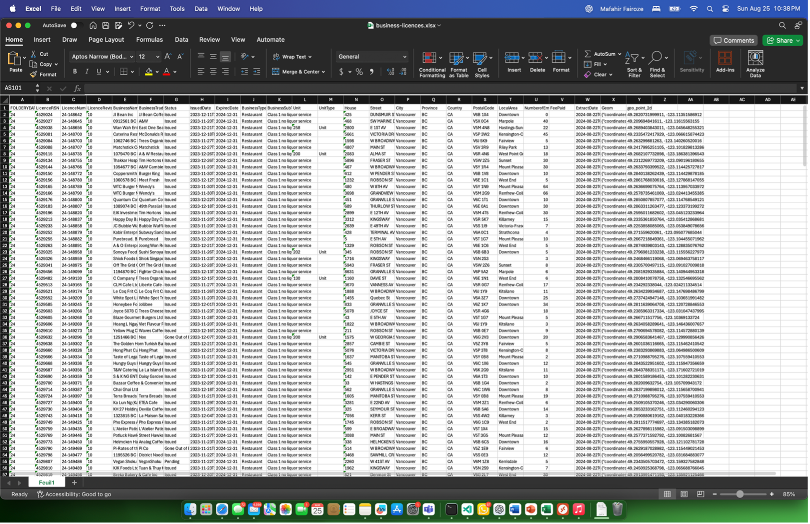

3. **Data Visualization and PDF Generation:**  
   - **AWS EC2 General Server:**  
     Set up an AWS EC2 general server instance using Windows Server OS. Microsoft Excel was installed on this server to create and generate visualizations from the EDA results.
     - The Excel graphs, based on the sum of employees per local area, were generated and exported as PDFs.
     - The final report, containing graphs such as bar charts and histograms, was compiled and saved as a PDF document on the EC2 instance.
   
   - **PDF Report Storage:**  
     The report was saved on the EC2 instance under a designated directory for easy access and sharing with stakeholders.

4. **Data Publication:**  
   - The generated PDF report was made available via a web server hosted on AWS EC2, allowing stakeholders to view and download the report from a remote location.
   - The EC2 instance was optimized for performance to handle potential user access.

### Tools & Technologies
- **AWS EC2 (General Server):** For Excel-based graph generation and PDF report creation.
- **AWS S3:** Storage of raw and processed datasets.
- **AWS Glue DataBrew:** Data cleaning and transformation.
- **Microsoft Excel:** Used on AWS EC2 for generating graphs and exporting them as PDF.
- **AWS Athena:** SQL-based data exploration.

### Deliverables
1. **Exploratory Data Analysis Report:**  
   A comprehensive report detailing the key findings from the analysis, including insights into employee distribution and business trends in Vancouver.

   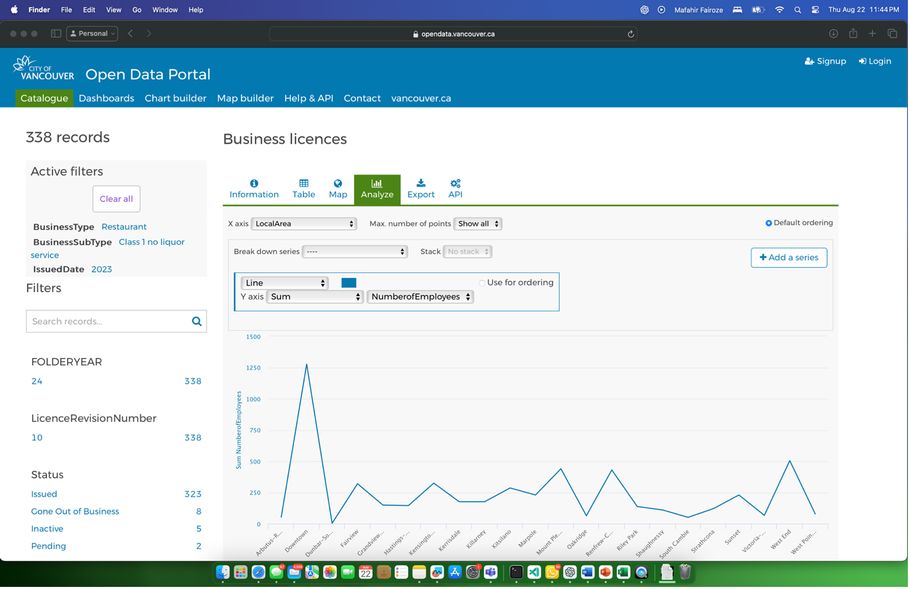
   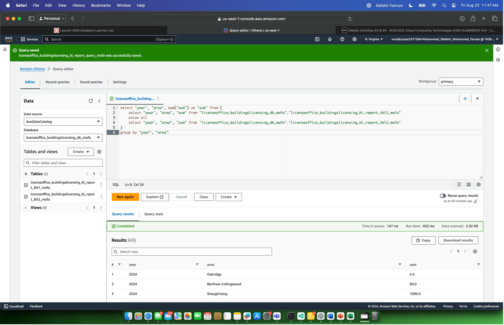

2. **PDF Graph Report:**  
   A comprehensive PDF report generated on the AWS EC2 instance containing visualizations of the EDA results, highlighting employee distribution across local areas.

   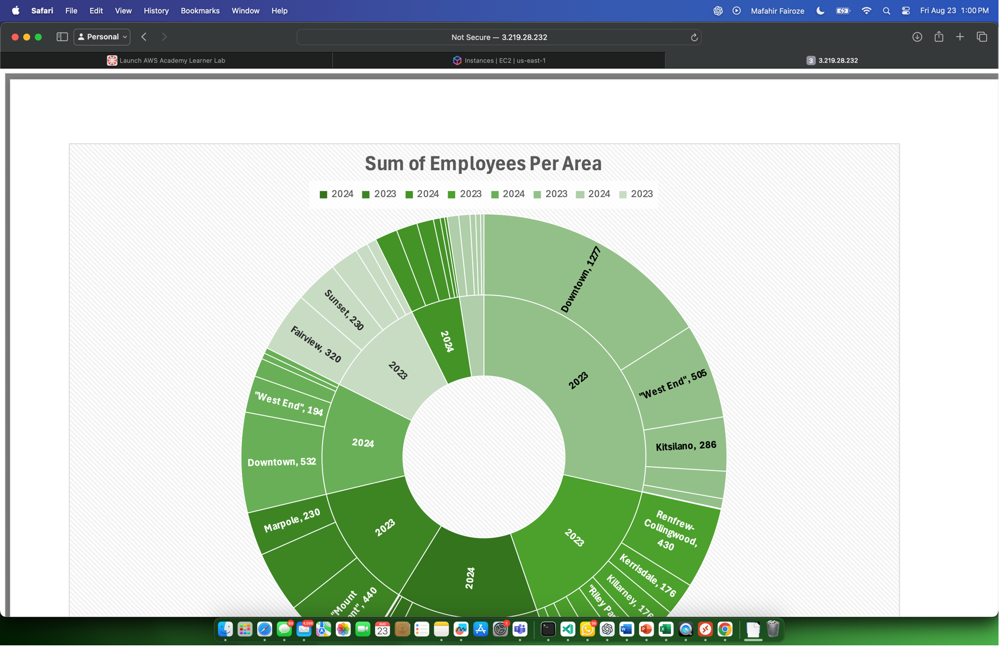

3. **EC2-Hosted Report:**  
   The PDF report hosted on an AWS EC2 instance, accessible via a web interface for stakeholders to view and download.

   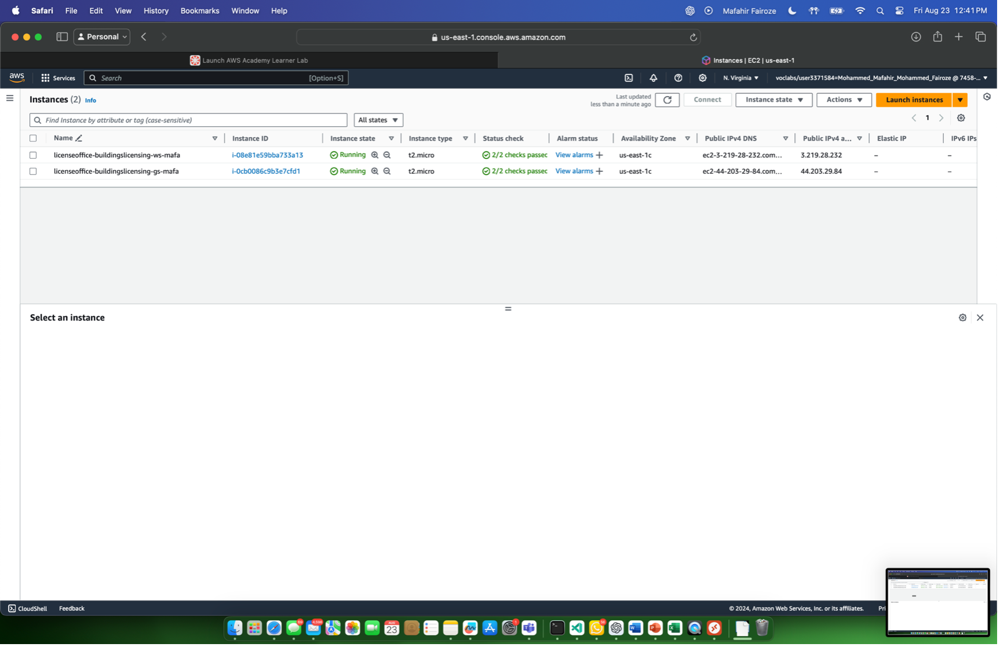
   
   

4. **Recommendations for Further Analysis:**  
   Based on the EDA findings, recommendations were made for further analysis, including specific regions and business types that warrant deeper investigation.

 

# Data Wrangling for Business Licenses in the City of Vancouver
This project focuses on cleaning, transforming, and preparing the City of Vancouver's business license dataset for further analysis. The raw data, spanning from 1997 to the present, contained several issues, including missing values and inconsistent formats. The goal of this project was to wrangle the data into a structured format, allowing for efficient exploration and analysis of business trends and the number of employees across different regions.

## Objective:  
The main objective of this data wrangling project was to clean and structure the business license dataset, making it suitable for analysis. This included handling missing values, standardizing formats, and creating new columns to facilitate further exploratory data analysis (EDA).

## Dataset:  
- **Source:** City of Vancouver Open Data Portal
- **Type:** Business License Records (1997 to present)
- **Format:** Tabular Excel format
- **Key Fields:**
  - License Number
  - Business Type
  - Sub-Type
  - Number of Employees
  - Local Area
  - Issued Date

## Methodology:  
1. **Data Collection:**  
   The dataset was downloaded from the Vancouver Open Data Portal in Excel format and loaded into AWS S3 for processing. It contains records from 1997 to the present and is updated daily.
   
   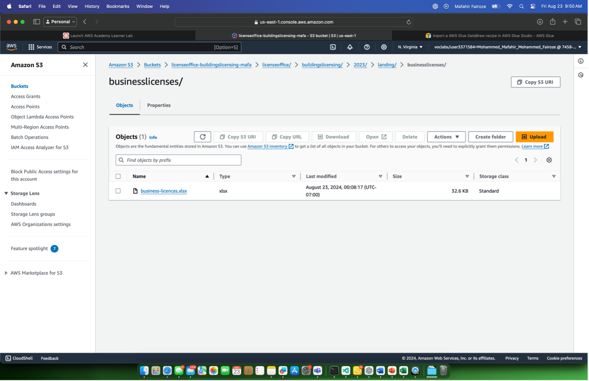
   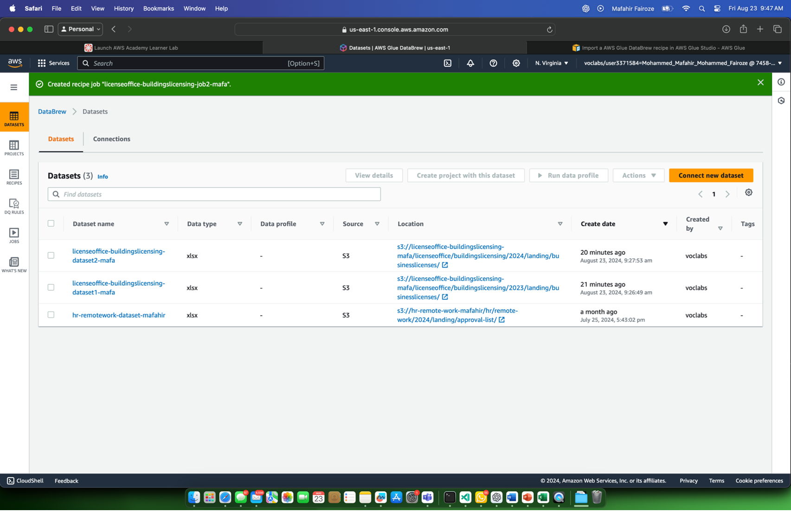
   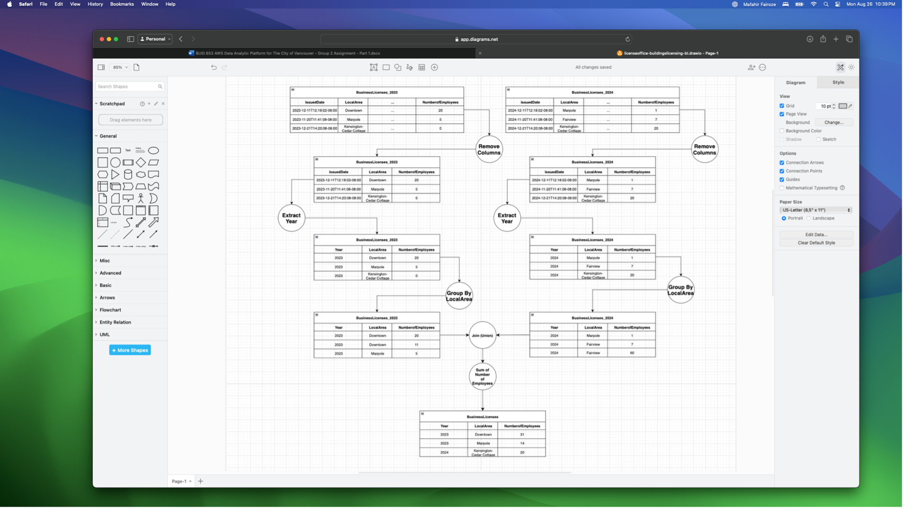

2. **Data Cleaning:**  
   - Removed rows with missing values in critical fields such as "Number of Employees" and "Local Area."
   - Standardized date formats and ensured consistency in "Business Type" and "Sub-Type" fields.
   - Handled duplicate entries by keeping the most recent record for each business license.
   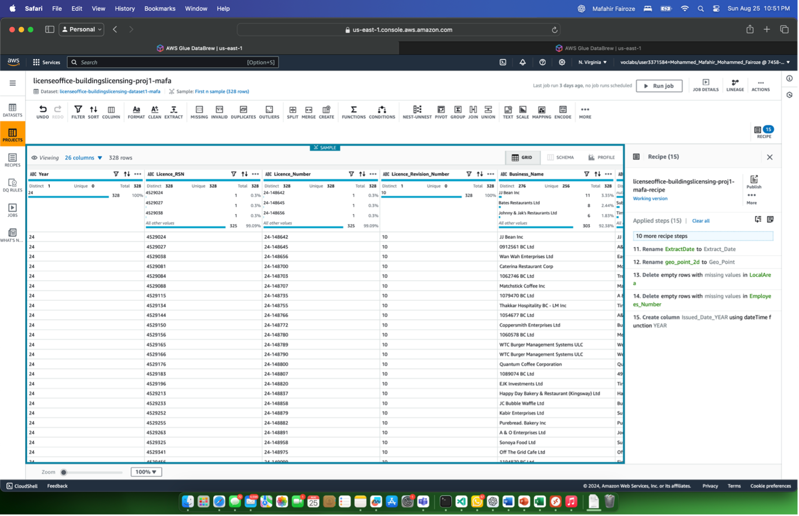

3. **Data Structuring:**  
   - Extracted the "Year" from the "Issued Date" column to enable year-wise analysis.
   - Grouped the dataset by "Local Area" and "Business Type" to summarize the data for further analysis.
   - Created a new column for the total number of employees by business type and local area.
   
   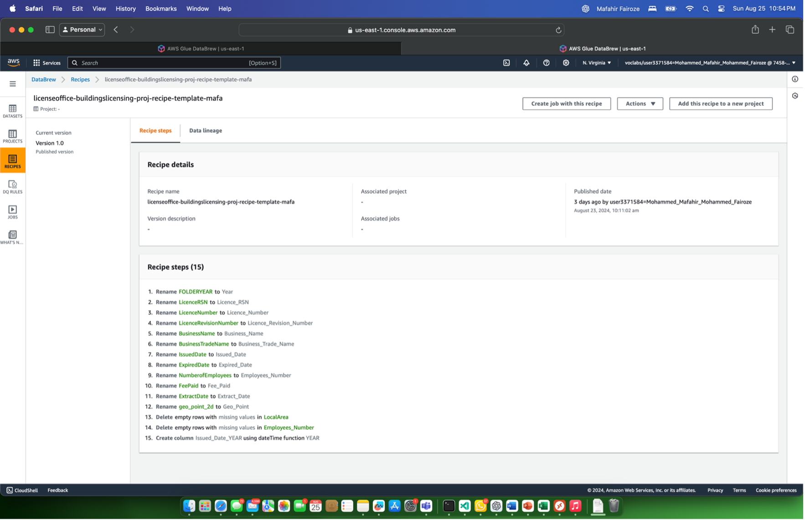

4. **Data Transformation:**  
   - Used AWS Glue DataBrew to automate the cleaning and structuring of the data.
   - Transformed the dataset into a more accessible format for analysis by removing unnecessary columns and renaming fields for clarity.

    
    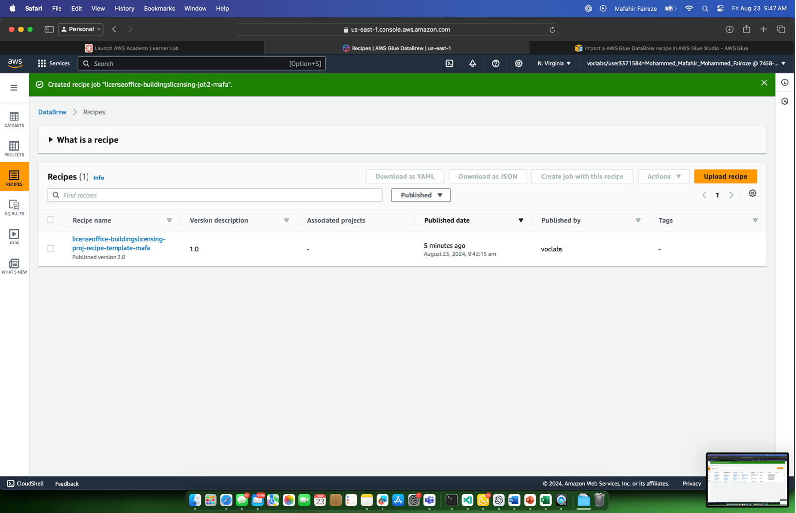
    
    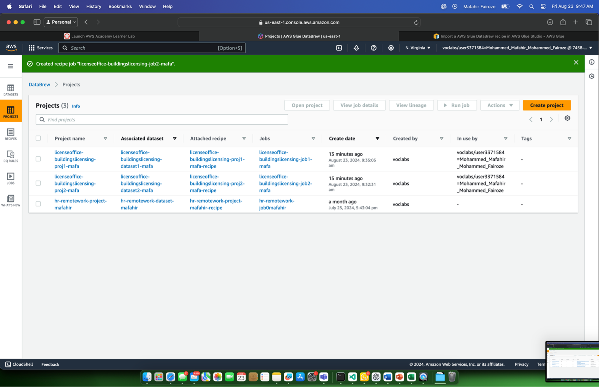

## Tools and Technologies Used:  
- **AWS S3:** Storage of the raw and cleaned datasets.
- **AWS Glue DataBrew:** Used for data cleaning and transformation.
- **Python (Pandas):** For additional data manipulation and wrangling.
- **Microsoft Excel:** Initial data exploration and visualization.

## Deliverables:  
1. **Cleaned and Structured Dataset:**  
   A finalized dataset with missing values handled, standardized formats, and columns for year-wise and local-area analysis. Stored in AWS S3 for easy access.
   
    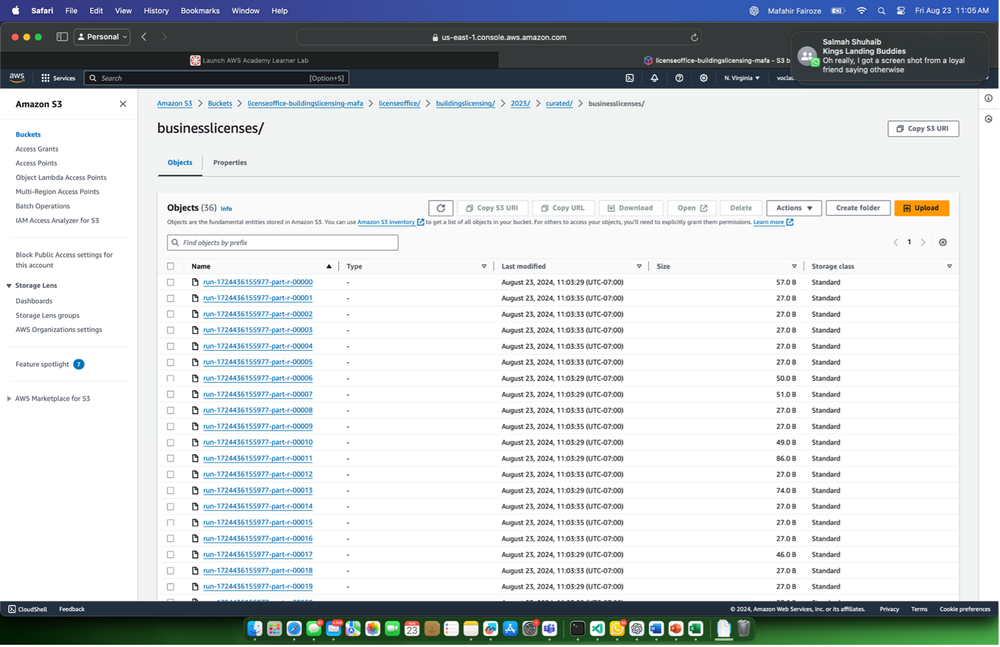

2. **Data Wrangling Report:**  
   A detailed report documenting the steps taken to clean and structure the dataset, along with the rationale behind key transformations.

3. **Metrics for Analysis:**  
   A summary of key metrics such as the sum of employees per local area and the total number of businesses by type, ready for use in subsequent exploratory data analysis.

4. **Automated Data Wrangling Pipeline:**  
   A reusable ETL pipeline built using AWS Glue, capable of handling future updates to the dataset with minimal manual intervention.
   
    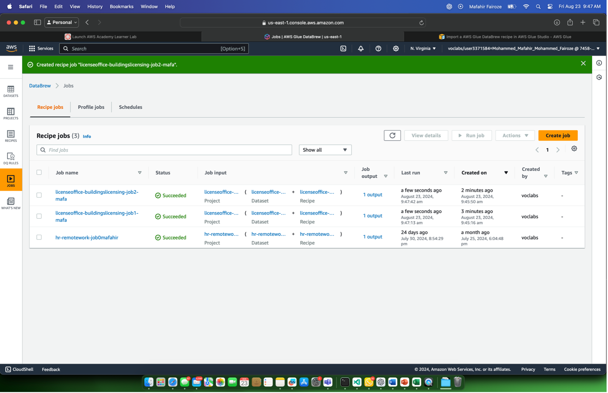

 

# Data Quality Control for Wrangled Business License Data in the City of Vancouver

## Project Description:  
This project implements data quality control as an essential step between data wrangling and exploratory data analysis (EDA) for the City of Vancouver's business license records. After wrangling the dataset to focus on three core fields—**sum of employees**, **local area**, and **year**—this phase ensures that the data is accurate, consistent, and reliable for analysis. This validation step is crucial to prevent issues in analysis caused by incomplete or incorrect data.

## Objective:  
The main objective of this phase is to ensure the quality of the wrangled dataset by performing checks on the **sum of employees**, **local area**, and **year** fields. The goal is to detect and resolve any data issues, such as missing values or inconsistencies, before proceeding to the EDA phase.

## Dataset:  
- **Source:** Output of the **data wrangling phase**.
- **Fields:**
  - Sum of Employees (`sum(numberOfEmployees)`)
  - Local Area
  - Year

## Methodology:  
1. **Input Dataset from Wrangling:**  
   The dataset used in this phase includes only the core fields: the **sum of employees** for each **local area** by **year**. This streamlined dataset is the output of the wrangling process and needs to be validated before moving to the EDA phase.

   

2. **Data Quality Checks:**  
   The following checks are performed to ensure that the dataset is ready for analysis:
   - **Completeness:** Ensures that all records in the key fields—**sum of employees**, **local area**, and **year**—are sufficiently populated, with at least 95% non-null values.
   - **Consistency:** Ensures that the **year** field is formatted consistently and that **local area** names are standardized across the dataset.
   - **Logical Integrity:** Checks that the **sum of employees** has logical values (i.e., no negative or implausible values), and that all **local areas** have associated data for each **year**.

   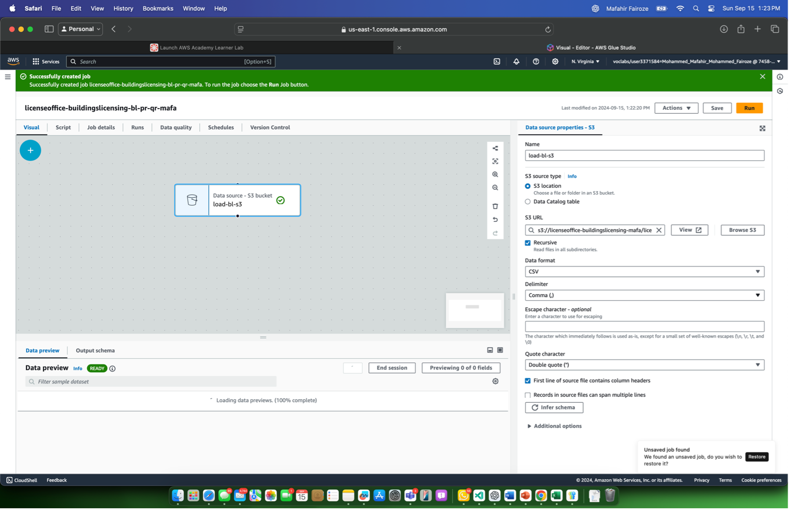
   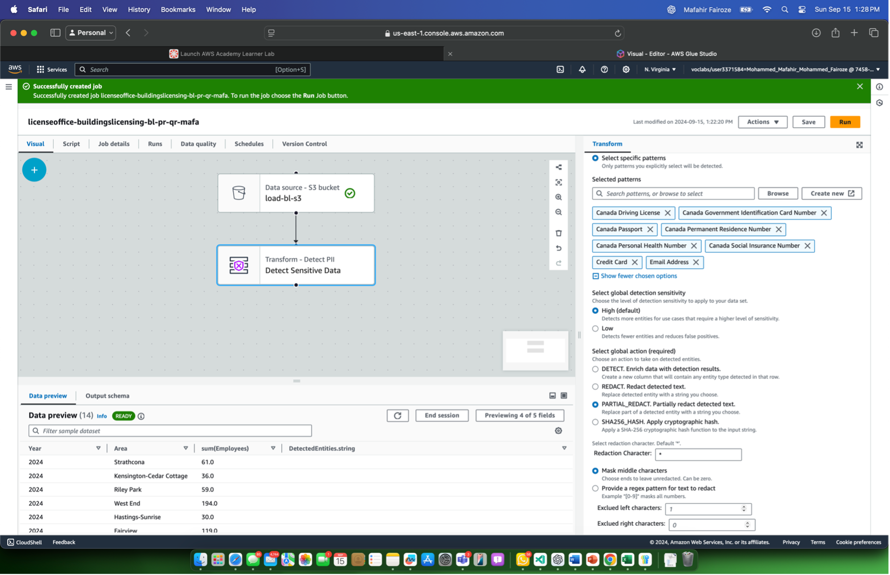
   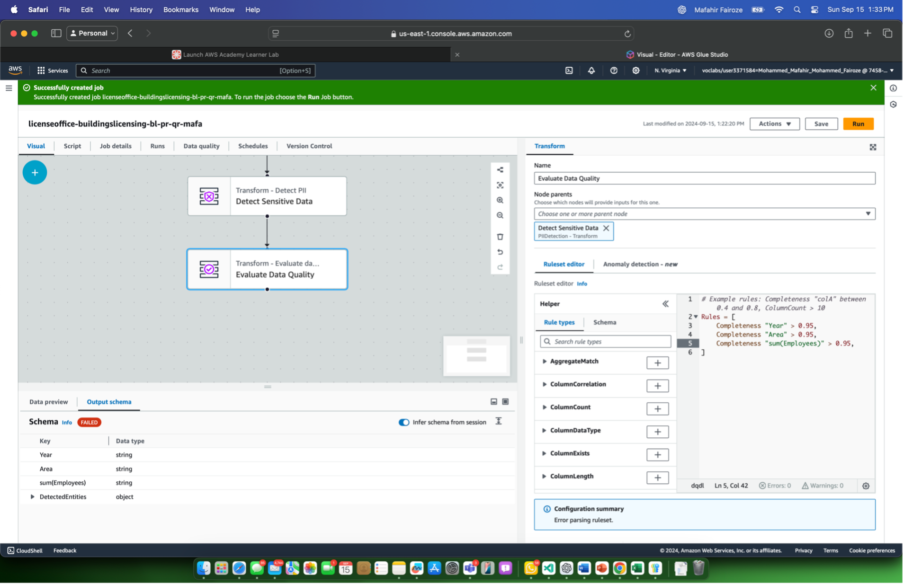

3. **Data Segmentation and Routing:**  
   Based on the results of the quality checks, the data is routed into two groups:
   - **Pass Group:** Records that meet all data quality standards are sent to the trusted data zone.
   - **Fail Group:** Records that fail the checks are flagged for further review and correction.

      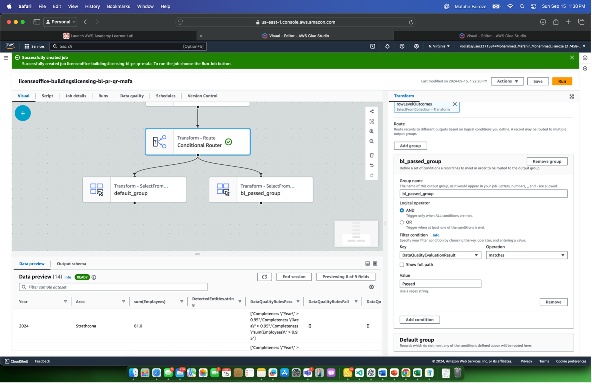
   
   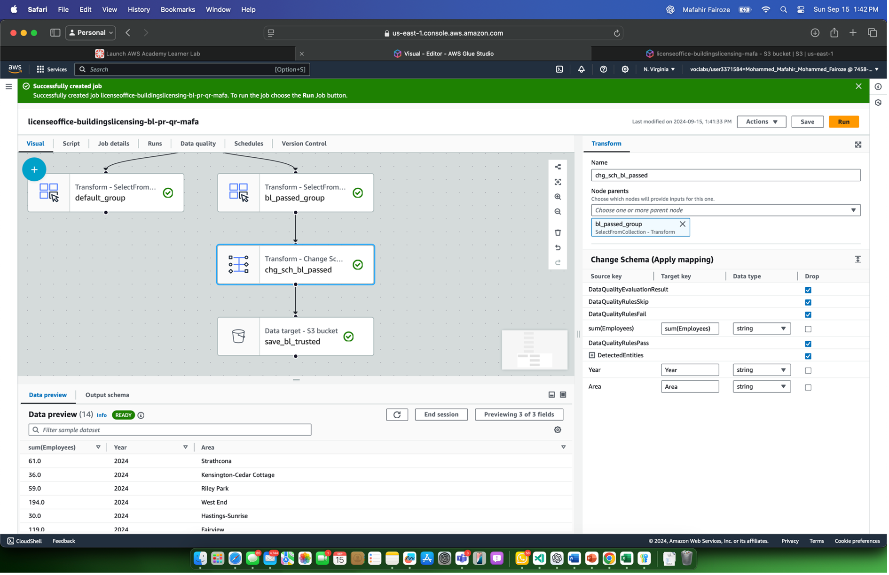
   

4. **Data Storage in Trusted Zone:**  
   The validated dataset is stored in a trusted S3 bucket, ensuring that only high-quality data moves on to the EDA phase. This storage step guarantees that analysis is performed using accurate and reliable information.
    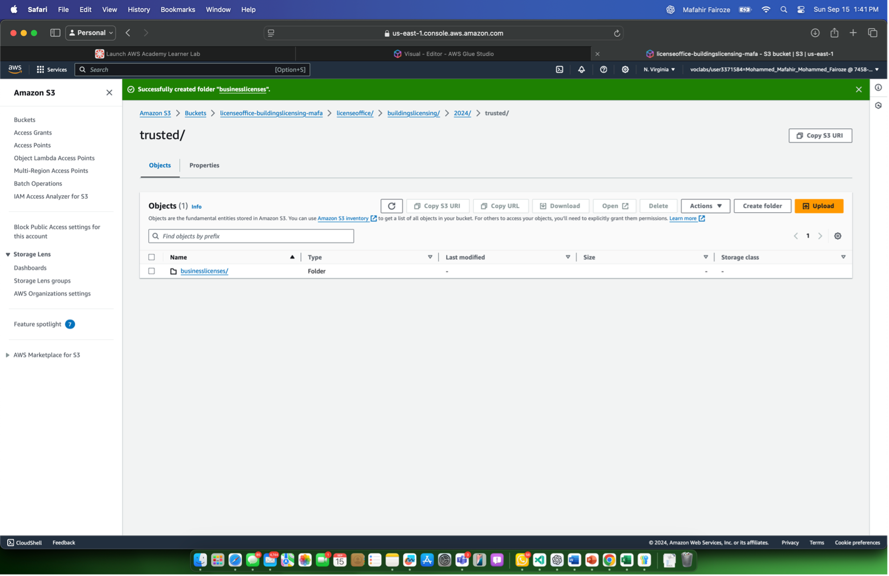
    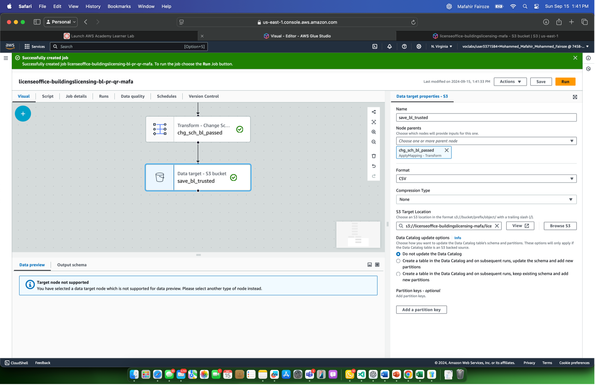
    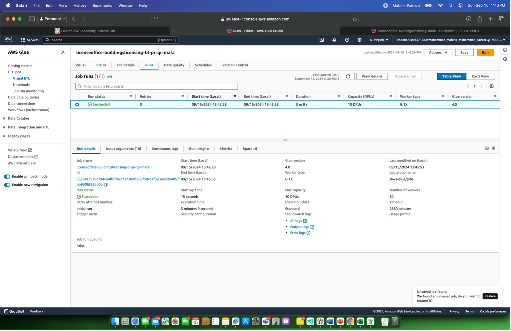
   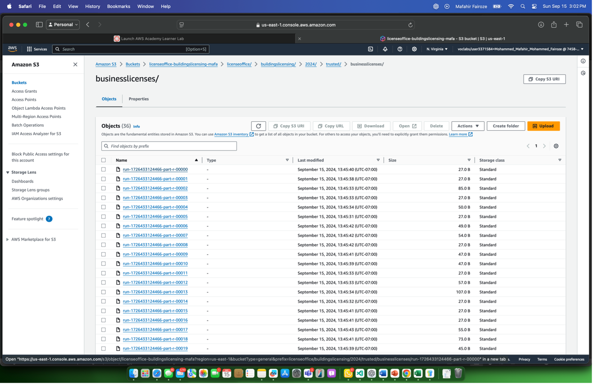

## Tools and Technologies Used:  
- **AWS Glue:** For performing data transformation and quality checks.
- **AWS S3:** For storing both the wrangled and validated datasets in a secure, trusted zone.

## Deliverables:  
1. **Data Quality Control Report:**  
   A report that documents the results of the data quality checks, including details on completeness, consistency, and logical integrity of the dataset.

2. **Validated Dataset:**  
   A cleaned and validated dataset, containing the **sum of employees**, **local area**, and **year** fields, stored in the trusted S3 bucket and ready for further analysis in the EDA phase.

3. **Automated Data Quality Pipeline:**  
   An AWS Glue pipeline designed to automatically apply the quality checks to any new data ingested into the system, ensuring that the dataset meets the required standards before proceeding to EDA.

    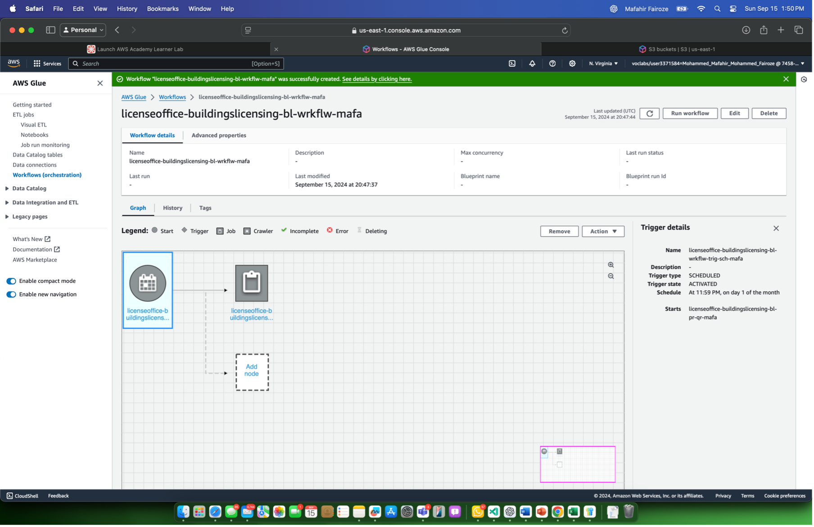
   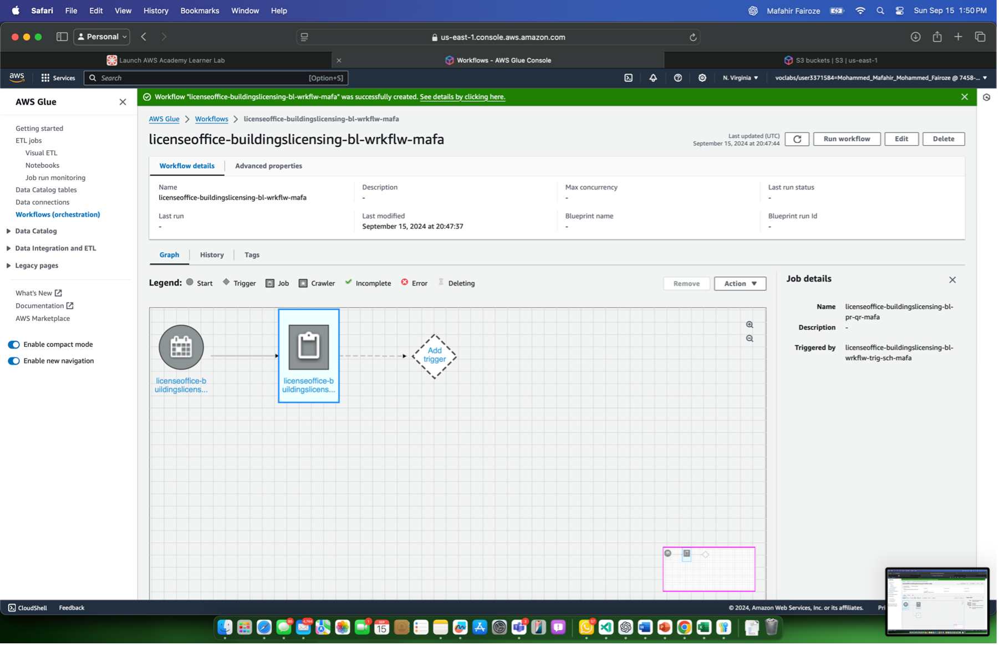